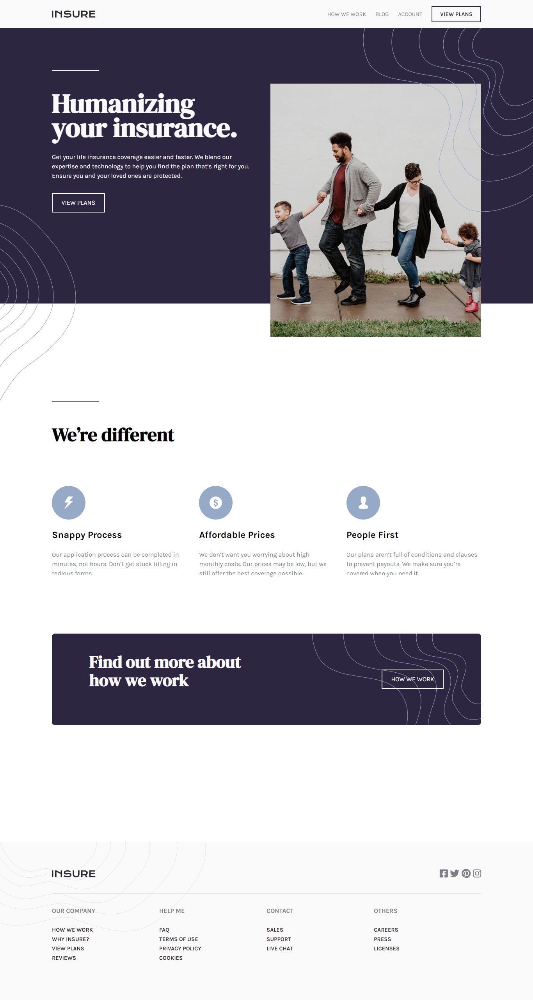

# Frontend Mentor - Insure landing page solu
This is  the [Insure landing page challenge on Frontend Mentor](https://www.frontendmentor.io/challenges/insure-landing-page-uTU68JV8). Frontend Mentor challenges help you improve your coding skills by building realistic projects. 

## Table of contents

- [Frontend Mentor - Insure landing page solu](#frontend-mentor---insure-landing-page-solu)
  - [Table of contents](#table-of-contents)
  - [Overview](#overview)
    - [Requirements](#requirements)
    - [The challenge](#the-challenge)
    - [Screenshot](#screenshot)
    - [Links](#links)
  - [My process](#my-process)
    - [Built with](#built-with)
    - [What I learned](#what-i-learned)
    - [Continued development](#continued-development)
    - [Useful resources](#useful-resources)
  - [Author](#author)

## Overview
### Requirements
- Responsive fluid layout 
- Navigation toggle for mobile
- hover states
- sticky navigation header
### The challenge

Users should be able to:

- View the optimal layout for the site depending on their device's screen size
- See hover states for all interactive elements on the page

### Screenshot

### Links

- Solution URL: [Add solution URL here](https://github.com/alialaba/frontend-mentor-challenge/tree/main/insure-landing-page)
- Live Site URL: [Add live site URL here](https://best-insure-landingpage.netlify.app)

## My process

### Built with

- Semantic HTML5 markup
- CSS custom properties
- Flexbox
- CSS Grid
- Basic-first workflow
- Positioning (relative, absolute)
- Pseudo Elements (::before ::after)

### What I learned
- Strengthen my knowledge on BEM pattern for naming convention.
- Understand the trick of min css property and minmax() with grid Css
- Enhance my css positioning skills and usage of pseudo elements

### Continued development
- CSS grid layout
- Css positioning and pseudo element
- Responsiveness (fluid spacing, layout and fluid font size). 

### Useful resources

- [A Deep Dive Into CSS Grid minmax()](https://ishadeed.com/article/css-grid-minmax/) - This helped me  to achieve a 3 column responsive layout with 3 lines of code. I really liked this pattern and will use it going forward.
- [Background position](https://css-tricks.com/almanac/properties/b/background-position/) - This is an amazing article which helped me finally understand to position bg images in x and y axis. I'd recommend it to anyone still learning this concept.

## Author

- Website - [Aliyu AbdulGaniy](https://www.github.com/alialaba)
- Frontend Mentor - [@alialaba](https://www.frontendmentor.io/profile/alialaba)
- Twitter - [@thisaliaba](https://www.twitter.com/thisaliaba)

